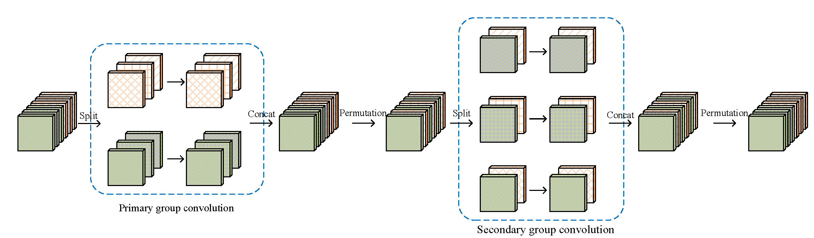
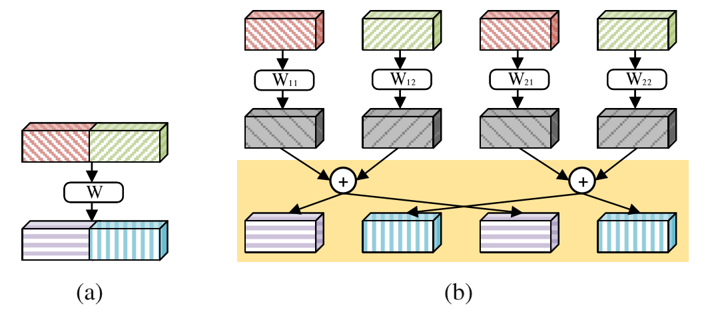

# Interleaved Group Convolutions for Deep Neural Networks

## Introduction
The codes are simple re-implement version for paper: Interleaved Group Convolutions for Deep Neural Networks. (IGCV V1)

> Zhang T, Qi G J, Xiao B, et al. Interleaved Group Convolutions for Deep Neural Networks[J]. 2017. [arXiv:1707.02725](https://arxiv.org/abs/1707.02725)

Some details are different from the description in origin paper.

## Structure
We present a simple and modularized neural network architecture, named interleaved group convolutional neural networks (IGCNets). The main point lies in a novel building block, a pair of two successive interleaved group convolutions: primary group convolution and secondary group convolution. The two group convolutions are complementary.

Our motivation comes from the four branch presentation of regular convolution illustrated in the following picture.

## Requirements
- jupyter notebook
- Python3
- PyTorch 0.3

## Results
We just test *IGCV_L24M2* in two datasets: Cifar10 and [Tiny ImageNet](https://tiny-imagenet.herokuapp.com/)

### Cifar-10

Models     | train(Top-1) | validation(Top-1) | L  | M  | D
---------- | ------------ | ----------------- | -- | -- | -
IGCV_L24M2 | 99.4         | 91.8              | 24 | 2  | 20

### Tiny ImageNet

Models     | train(Top-1) | validation(Top-1) | L  | M  | D
---------- | ------------ | ----------------- | -- | -- | -
IGCV_L24M2 | 71.2         | 58.1              | 24 | 2  | 20